# Introduzione {.unnumbered}

Questo portale raccoglie le slide e una selezione di esercizi di **Statistica Medica** pensati per accompagnare lo studio teorico e le lezioni frontali dei corsi tenuti da Corrado Lanera e destinati ai percorsi di laurea delle *Professioni Sanitarie* dell’Università di Padova per un corso da 20 ore (2 CFU).

Le slide e gli esercizi coprono i principali argomenti affrontati nel corso:

-   **Statistica descrittiva**, con esempi di sintesi numerica e grafica dei dati.\
-   **Concetti fondamentali di probabilità**, utili a comprendere il ragionamento diagnostico.\
-   **Probabilità condizionata e teorema di Bayes**, applicati alla valutazione delle prestazioni dei test diagnostici.
-   **Distribuzioni di probabilità**, per modellare variabili casuali discrete (Binomiale e Poisson) e continue (Normale e Normale Standard).\
-   **Stima puntuale e intervalli di confidenza**, per quantificare l’incertezza delle stime.\
-   **Test di ipotesi** per misure continue, per prendere decisioni basate sui dati osservati.\

Ogni esercizio è pensato per favorire la comprensione intuitiva dei concetti, più che la semplice applicazione di formule. L’obiettivo è abituarsi a **leggere, interpretare e ragionare sui dati** in contesti clinici e di ricerca.

Gran parte degli esercizi sono tratti da testi di riferimento, articoli scientifici o dataset reali. Si veda la bibliografia per i riferimenti completi.

::: callout-note
Se fate o avete eserczi che desiderate venganon aggiunti all'elenco, contattatemi pure!
:::

------------------------------------------------------------------------

## Come utilizzare questo materiale {.unnumbered}

Il materiale può essere usato in due modi complementari:

1.  **In parallelo alle lezioni**, per consolidare i concetti appena introdotti.\
2.  **Come preparazione all’esame**, selezionando gli argomenti di maggiore difficoltà o interesse.

::: callout-note
Gli esercizi nelle slide sono tutti svolti, si suggerisce agli studenti di provare a risolverli autonomamente prima di guardare la soluzione.
:::

------------------------------------------------------------------------

## Suggerimenti per lo studio {.unnumbered}

-   Leggi sempre **il testo dell’esercizio** con attenzione prima di passare ai calcoli.\
-   Cerca di **interpretare il significato clinico** dei risultati numerici: la statistica non è solo calcolo, ma anche comprensione del contesto.\
-   Ricorda che, in ambito didattico, se viene posto un problema vuol dire che:
    -   si può risolvere
    -   si può risolvere con gli strumenti che hai a disposizione Dunque, provare a individuare e scrivere bene i dati, considerare le formule affrontate e riportate nella sezione appena precedente e ragionare su come poter adattare e sfruttare gfi strumenti proposti, coi dati forniti, per risolvere il problema.
-   Confronta i tuoi risultati con quelli discussi a lezione; sopratutto, discutili con i colleghi.\
-   \[OPZIONALE\] Se utilizzi R, prova a **riprodurre le analisi passo per passo**, verificando come cambiano i risultati al variare dei dati.

------------------------------------------------------------------------

## Suggerimenti e indicazioni per l'esame {.unnumbered}

### Materiale **necessario**

-   **Tavole delle distribuzioni** (Z e t di Student, non ne servono altre) - fornite dal docente in formato cartaceo durante il corso (vanno bene anche altre).

-   **Calcolatrice scientifica base** (non è permesso l’uso di smartphone o tablet). La più semplice ed economica che trovate e che sia in grado di fare l'esponenziale ($e^x$) va benissimo ed è sicuro sufficiente. Una mia rassegna di calcolatrici di esempio di varie marche che vanno sicuramente bene sono elencate in fondo a questa pagina.

### Materiale ammesso

-   qualunque materiale cartaceo **personale** (appunti, libri, dispense, eccetera) - non è permesso condividere materiale cartaceo tra studenti durante l’esame.

### Materiale non ammesso

-   dispositivi elettronici connessi a internet (smartphone, tablet, computer portatili, eccetera);
-   calcolatrici programmabili o con funzionalità avanzate (grafici, simboliche, eccetera);

------------------------------------------------------------------------

## Aggiornamenti {.unnumbered}

Questo materiale è in **costante aggiornamento**.\
Eventuali correzioni, estensioni o nuove versioni saranno rese disponibili attraverso i canali ufficiali del corso o tramite il profilo docente.

Per segnalare errori, suggerimenti o proposte di miglioramento, contattatemi pure via email ([corrado.lanera\@ubep.unipd.it](mailto:corrado.lanera@ubep.unipd.it)), tramite i canali ufficiali del corso, o aprendo un [issue](https://github.com/CorradoLanera/statistica-medica-short/issues) dalla pagina di sviluppo del corso (<https://github.com/CorradoLanera/statistica-medica-short>)

------------------------------------------------------------------------

## Calcolatrici scientifiche di esempio {.unnumbered}

::: callout-note
In ambito calcolatrici scientifiche, "più costosa" non significa necessariamente “migliore”. Un prezzo maggiore spesso corrisponde semplicemente a più funzioni (o un prodotto meno diffuso commercialmente) o a un display più evoluto, ma nella maggior parte dei casi molte di quelle funzioni non verranno mai usate. Per la gran parte dei calcoli matematici e statistici di base (e non solo) che ci serviranno, bastano poche operazioni fondamentali: aritmetica base, parentesi, memorie, potenze, radici, logaritmi, e l’esponenziale naturale $e^x$. Dalla mia esperienza, se una calcolatrice è in grado di fare $e^x$ (o ha addirittura un tasto dedicato per $e$, allora ha tutte le funzioni che servono e, tranne una eccezione (unica che ho trovato: Casio FX-Junior Plus), se una calcolatrice non è in grado di fare $e^x$ allora non ha tutte le funzioni base elencate qui sopra).

I modelli raccolti in questa selezione non rappresentano “le migliori in assoluto”, ma piuttosto una mia panoramica con la filosofia alla base della scelta che punti alla chiarezza e dell’usabilità: lo strumento deve essere un supporto al ragionamento, non un ostacolo.

Tutte le calcolatrici di questa lista — e molte altre analoghe di altre marche — vanno bene per i nostri scopi. Se vi serve sapere se la "vostra" va bene, cercate se potete fare $e^x$, se si, va bene di sicuro, se no, probabilmente no.
:::

::: {style="overflow-x: auto;"}
| Marca | Modello | Display | `e^x` | Memorie | Distribuzioni Z/t | Alimentazione | Giudizio costruttivo | Note sintetiche | Immagine |
|:-------|:-------|:------:|:------:|:------:|:------:|:------:|:------:|:-------|:------:|
| **Casio** FX | Junior Plus | 1 riga | ❌ | ❌ | ❌ | batteria | 🟡 base | “Pre-scientifica” — minimalissima (per costante *e* usare approssimazione "a mano" 2.718, per il resto fa tutto! | 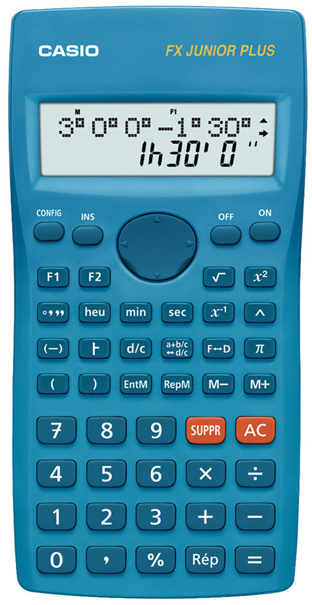 |
|  | 220 Plus II | 2 righe | ✅ | ✅ (1) | ❌ | batteria | 🟡 media | Economica (\~9 €), semplice, completa “minima” | 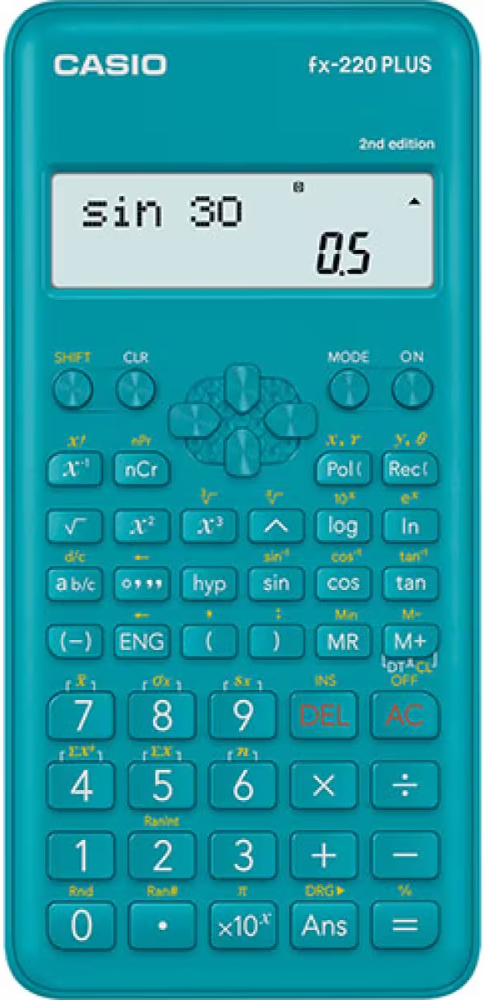 |
|  | 82 MS 2 | 2 righe | ✅ | ✅ (A–D) | ❌ | batteria | 🟡 media | Standard universitaria, equilibrata | 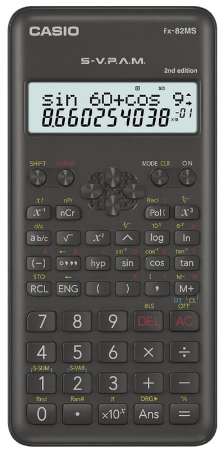 |
|  | 82 ES Plus 2 | naturale | ✅ | ✅ (A–D) | ❌ | batteria | 🟢 buona | Display naturale, essenziale (senza distribuzioni) | 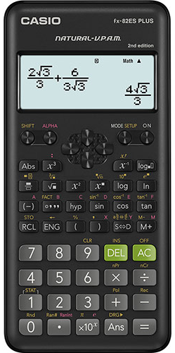 |
|  | 570 ES Plus 2 | naturale | ✅ | ✅ (A–D) | ✅ | batteria | 🟢 buona | Primo modello Casio con NORM/t; ottimo per percentili | 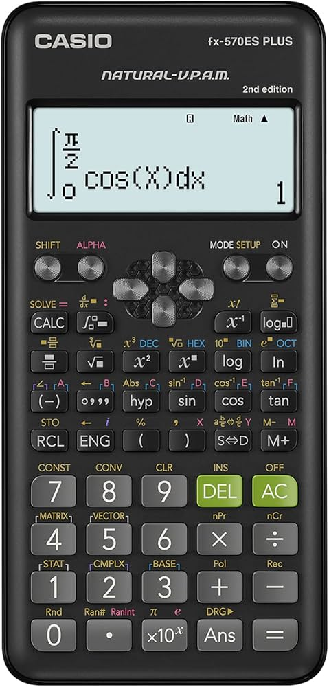 |
| **Sharp** EL | 501 T | 1 riga | ✅ | ✅ (1) | ❌ | batteria | 🟢 buona | Minimal solida, tasti eccellenti | 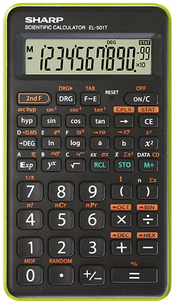 |
|  | 531 TH | 2 righe | ✅ | ✅ (A–D) | ❌ | batteria | 🟢 buona | Compatta, leggibile, sobria | 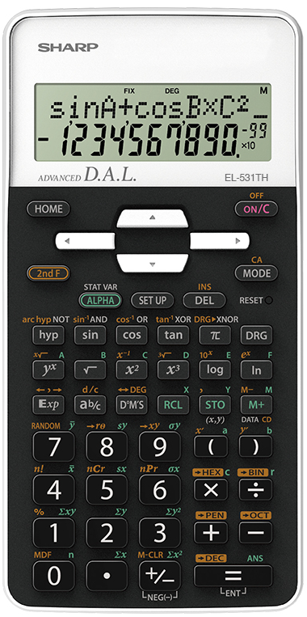 |
|  | W531 XH | naturale | ✅ | ✅ (A–D) | ✅ | batteria | 🟢 alta | Display naturale brillante, distribuzioni complete | 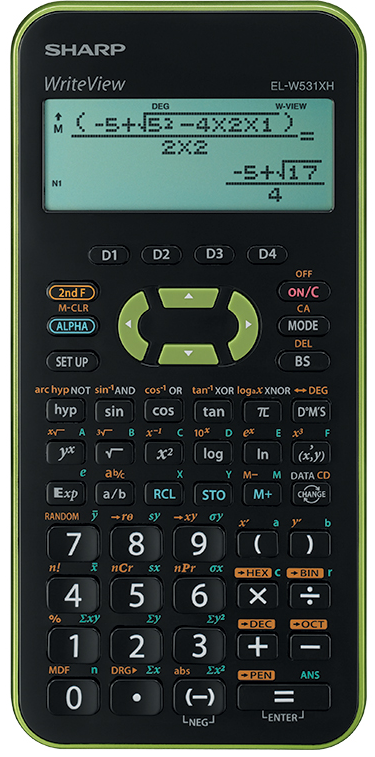 |
| **Texas Instr.** TI | 30 Xa | 1 riga | ✅ | ✅ (1) | ❌ | batteria | 🟢 alta | Storica, indistruttibile, minimalismo puro | 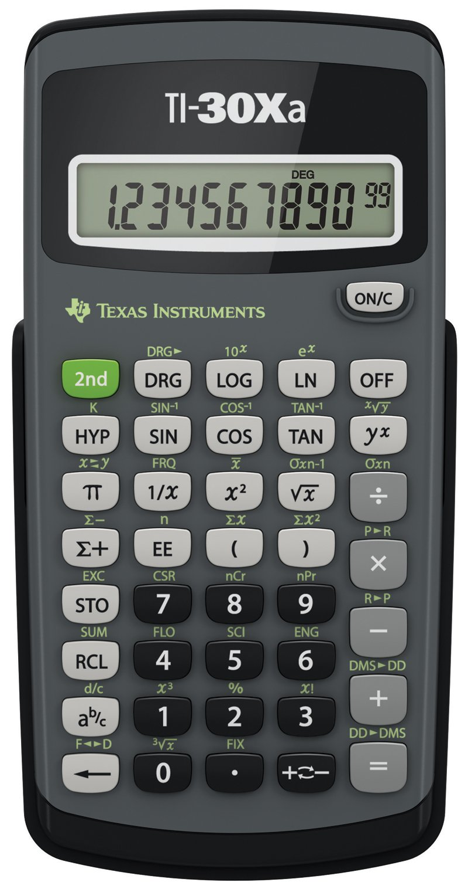 |
|  | 30 XIIB | 2 righe | ✅ | ✅ (1) | ❌ | batteria | 🟢 buona | Evoluzione Xa con frazioni e statistica base | 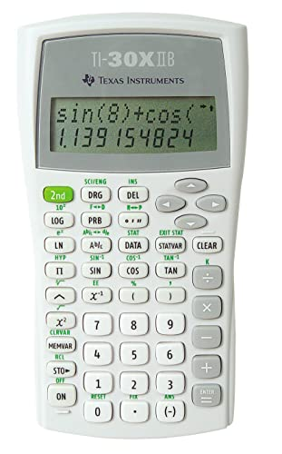 |
|  | 30 X Pro MathPrint | naturale | ✅ | ✅ (A–D) | ✅ | batteria | 🟢 alta | Natural MathPrint + InvNorm / InvT; top ergonomia | 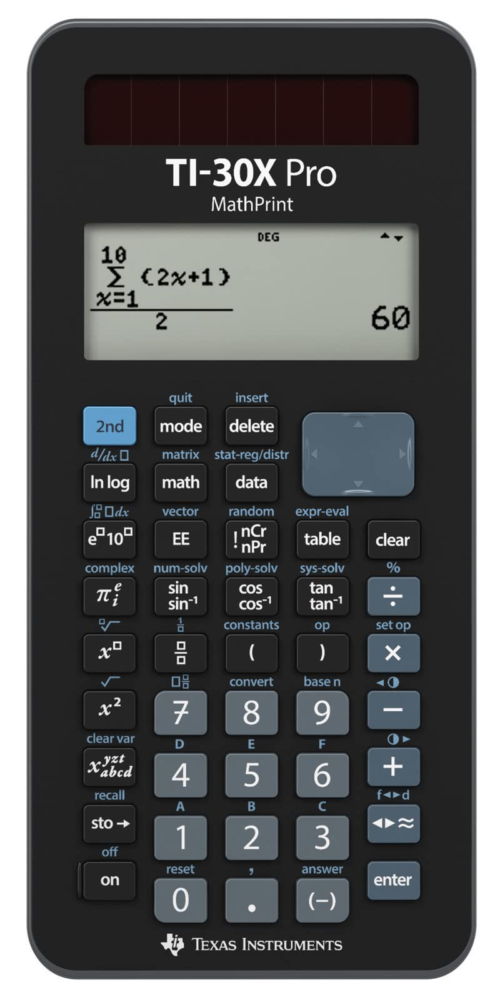 |
:::

::: callout-tip
Se dovete comprarla, e vi serve solo per l'esame, spendete meno possibile, non serve nulla di più complesso di una calcolatrice scientifica base: se fa esponenziale, tutto il resto che serve lo fa di sicuro.
:::

::: callout-tip
Per *tutti i giorni* (non potete usare app all'esame...) una calcolatrice sceintifica molto valida che funziona su browser e anche come app da cellulare è CalcES (https://mathda.com/calculator/it/), gratuita e open source.
:::